# Driftlock

[](https://github.com/KairosSignal/driftlock-agent-docs/actions/workflows/test.yml)

Driftlock is an agent skill and a dependency-free Python CLI for keeping
project documentation aligned with code as a repository changes.

It detects documentation drift deterministically, propagates review impact
through declared dependencies, routes agents through layered indexes, and keeps
archives outside the default context.

## See It in 14 Seconds



A change to `src/auth/session.py` makes the authentication contract `STALE` and
propagates `REVIEW_REQUIRED` only through its declared summary chain. The
unrelated billing contract stays `CURRENT` and out of the update queue.

## Why

Long-running projects often accumulate multiple status files, duplicated
architecture notes, stale handoffs, and large archives. An AI agent can then
read the wrong document, repeat completed work, or spend most of its context on
history.

Driftlock makes freshness deterministic. Markdown documents declare their
identity and relationships in a small JSON index block. The CLI records reviewed
content hashes in `.driftlock.lock.json` and reports computed states:

- `CURRENT`
- `STALE`
- `REVIEW_REQUIRED`
- `UNVERIFIED`

## Features

- Progressive L0/L1/L2 documentation indexes
- One project entry point for agent routing
- SHA-256 freshness checks for documents and watched code paths
- Dependency propagation for summaries, status, and contracts
- Git-aware verification with dirty-path protection
- Read-only discovery and archive planning
- Archive isolation from startup context and active dependency graphs
- Optional problem-register pattern that preserves unresolved feedback without
  converting every observation into an authorized task
- Recommended task-lifecycle semantics that distinguish review acceptance,
  integration, deployment, rework, and final closure without imposing a universal
  tracker schema
- Structured JSON output for agents and CI
- Standard-library Python with no runtime dependencies

## Problem Intake Without Task Sprawl

Driftlock distinguishes unresolved observations from authorized work. A project
may keep user feedback, screenshots, UX complaints, or historical defects in an
external issue tracker or in a repository-native current problem register. The
register is optional; the requirement is one authoritative intake path.

A problem record does **not** authorize implementation. Historical feedback
should normally start as `needs_revalidation`, then become `confirmed`,
`obsolete`, `parked`, or linked to an authoritative task after current evidence
is checked. Large registers should stay out of default startup context and be
loaded only when the current task touches the affected area.

See `references/problem-register-and-feedback.md` for the recommended states,
minimum fields, task boundary, deduplication rules, and a Driftlock index
example.

## Current Release: 0.2.2

`0.2.2` adds recommended task lifecycle/status semantics so repository-native
projects can distinguish implementation, review acceptance, integration,
deployment, rework, and final closure. It also adds a concrete repository
problem-register adoption checklist while preserving the rule that problem intake
does not authorize implementation.

There is no index-schema change and no breaking CLI command change from `0.2.1`.

## Agent Compatibility

Driftlock is not tied to one model or coding agent:

- Any agent with shell access can run the Python CLI.
- Agents that support `SKILL.md` packages can load the repository as a skill.
- Agents without a skill system can use `SKILL.md` as project instructions and
  call `scripts/driftlock.py` directly.
- Humans and CI can use the same CLI without an agent.

`agents/openai.yaml` provides optional OpenAI/Codex interface metadata. The core
skill and CLI do not import or depend on OpenAI libraries.

## Install

Clone the repository into the skill or instruction directory used by your
agent:

```bash
git clone https://github.com/KairosSignal/driftlock-agent-docs.git
```

Then either register the cloned directory as the `driftlock` skill or run the
CLI from it. Consult your agent's documentation for its skill discovery
directory.

### Codex

Ask Codex to install the public skill:

```text
Install the Driftlock skill from https://github.com/KairosSignal/driftlock-agent-docs
```

Or clone it into the Codex skills directory:

```bash
git clone https://github.com/KairosSignal/driftlock-agent-docs.git \
  ~/.codex/skills/driftlock
```

Restart Codex after installation so the skill is discovered.

## Use With An Agent

For any agent, ask it to read `SKILL.md` and use the bundled CLI:

```text
Read the Driftlock SKILL.md, audit this repository's documentation, and report
the minimum updates needed. Do not read archives unless required.
```

### Codex

Invoke the skill explicitly:

```text
Use $driftlock to audit this repository's documentation and report the minimum
updates needed. Do not read archives unless required.
```

The skill also triggers for documentation audits, reorganization, freshness
validation, archive isolation, project-map creation, and task/report sprawl.

## CLI

Requirements:

- Python 3.9 or newer
- Git 2.25 or newer for commit-aware verification
- Linux, macOS, or Windows

Git is optional only in explicit hash-only mode. Without Git, `verify` requires
`--allow-hash-only` and reports reduced assurance.

Run the CLI directly from the skill directory:

```bash
python3 scripts/driftlock.py discover /path/to/project
python3 scripts/driftlock.py check /path/to/project
python3 scripts/driftlock.py impact /path/to/project --since HEAD~1
python3 scripts/driftlock.py verify /path/to/project \
  --doc project-entry --status-effect initial
python3 scripts/driftlock.py archive-plan /path/to/project
```

Add `--format json` for automation.

`discover`, `check`, `impact`, and `archive-plan` are read-only. `verify` is the
only writing command, and it writes only `.driftlock.lock.json` atomically.

CLI JSON reports and generated lock files include `tool_version`. The current
release line is `0.2.2`.

## File Format

Driftlock uses its own v0.2 format:

- `.driftlock.lock.json` stores verified document state.
- `driftlock-index` is the Markdown metadata fence.
- `scripts/driftlock.py` is the only CLI implementation.

The target repository is always selected at runtime with `project_root`; none of these identifiers are a target-project name.

## Runnable Demo

Run the bundled example from any checkout:

```bash
python3 examples/run_demo.py
```

The demo creates a temporary Git repository, verifies four documents to
`CURRENT`, changes authentication code, and checks that only the authentication
contract and its summary chain enter the update queue. It also demonstrates the
CI contract: exit code `1` is ordinary stale state, while only `2` and `3`
block.

## Minimal Index

Every managed Markdown file contains one fenced `driftlock-index` block with
strict JSON. A minimal L0 entry looks like this:

````markdown
```driftlock-index
{
  "schema_version": 2,
  "id": "project-entry",
  "authority_key": "project.entry",
  "level": 0,
  "role": "project_entry",
  "lifecycle_status": "active",
  "startup": [
    "docs/current/status.md",
    "docs/current/task-board.md"
  ],
  "startup_budget": {
    "max_files": 5,
    "max_characters": 12000
  },
  "archive_roots": [
    "docs/archive"
  ]
}
```
````

Use `discover` first when a repository has no valid L0 entry. It reports
candidates without inventing authority or moving files.

## Recommended Workflow

1. Run `discover` to understand the existing documentation.
2. Establish one L0 entry and narrow L1 branches.
3. Identify the authoritative task system and, when needed, the authoritative
   unresolved-problem/feedback intake. Do not make the task board serve both roles.
4. Add indexes and explicit dependency edges.
5. Review each document and run `verify`.
6. Commit `.driftlock.lock.json` with the reviewed documents.
7. Run `check` in agent workflows or CI.

Driftlock never automatically rewrites semantic content, assigns authority,
moves documents, or deletes archives. Those remain explicit human or agent
decisions.

## Exit Codes

| Code | Meaning |
|---:|---|
| `0` | Current and structurally valid |
| `1` | Ordinary stale, review-required, or unverified state |
| `2` | Structural error or refused verification |
| `3` | Argument, Git, permission, JSON, or filesystem failure |

CI wrappers should treat `0` and `1` as non-blocking and block only on `2` or
`3`.

## Test

```bash
python3 -m unittest discover -s tests -p 'test_*.py'
```

## License

MIT